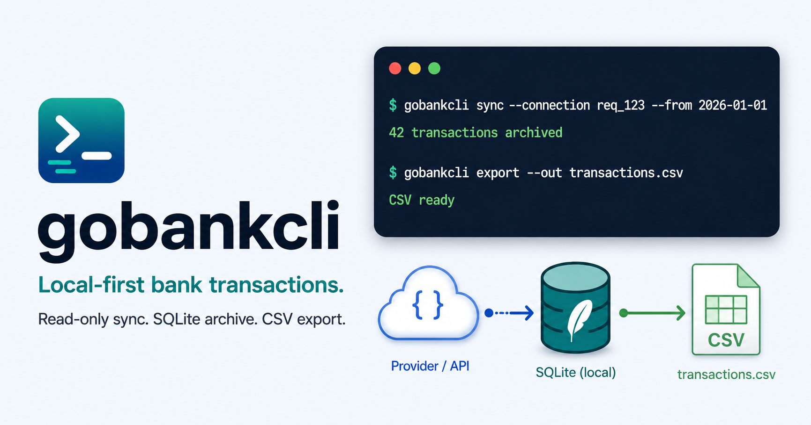

[](https://github.com/BramVR/goBankCli/actions/workflows/pages.yml)
[](https://gobankcli.bramvanrompuy.be/)
[](go.mod)
[](LICENSE)



# gobankcli

`gobankcli` is a local-first, read-only bank transaction archive. It fetches
bank data through safe provider APIs, stores normalized records in SQLite, and
exports stable CSV for budgeting and accounting.

Public docs: [gobankcli.bramvanrompuy.be](https://gobankcli.bramvanrompuy.be/)

Start there for:

- [install](https://gobankcli.bramvanrompuy.be/install.html)
- [quickstart](https://gobankcli.bramvanrompuy.be/quickstart.html)
- [provider setup](https://gobankcli.bramvanrompuy.be/provider-setup.html)
- [archive/query/export usage](https://gobankcli.bramvanrompuy.be/archive-query-export.html)
- [security model](https://gobankcli.bramvanrompuy.be/security.html)

## What it is

Built for terminals, shell scripts, cron, and coding agents:

- predictable `--json` and `--plain` output on stdout
- human hints and warnings on stderr
- local SQLite archive
- normalized CSV export
- read-only SQL inspection
- no scraping, payment initiation, bank password storage, or hard-coded secrets
- no `float64` money values

## Non-goals

- no scraping
- no payment initiation
- no bank password storage
- no cloud upload
- no real bank data in tests, docs, examples, logs, or commits

## Current Scope

- generic provider abstraction
- GoCardless Bank Account Data provider
- Enable Banking AIS provider
- institutions, consent connections, accounts, booked transactions, sync runs
- local SQLite archive with raw provider JSON preserved
- normalized transaction CSV export
- read-only `query`/`sql` against the archive

Only booked transactions are archived. Pending transactions from provider
payloads are ignored for now.

## Install

After the first release is authorized and published, Homebrew will be the
preferred install path on macOS and Linux:

```bash
brew install BramVR/tap/gobankcli
gobankcli --version
```

Until then, build from source.

Build from source:

```bash
git clone https://github.com/BramVR/goBankCli.git
cd goBankCli
make build
./bin/gobankcli --help
```

Install the built binary for your user:

```bash
mkdir -p ~/.local/bin
install -m 755 ./bin/gobankcli ~/.local/bin/gobankcli
```

Make sure `~/.local/bin` is on your `PATH`, then use `gobankcli` from any
terminal.

Run without installing:

```bash
go run ./cmd/gobankcli --help
```

## Quick Start

Build the CLI, create local config, and inspect the setup:

```bash
make build
./bin/gobankcli init
./bin/gobankcli doctor
```

Use Enable Banking as the main live provider. Create a production application in
the Enable Banking dashboard with this redirect URL:

```text
https://127.0.0.1:28787/enablebanking/callback
```

Install the downloaded PEM key and set environment variables:

```bash
ENABLEBANKING_APPLICATION_ID="replace-with-your-application-id"
mkdir -p ~/.config/gobankcli
install -m 600 "$HOME/Downloads/${ENABLEBANKING_APPLICATION_ID}.pem" ~/.config/gobankcli/enablebanking.pem

cat > ~/.config/gobankcli/enablebanking.env <<EOF
export GOBANKCLI_ENABLEBANKING_APP_ID="$ENABLEBANKING_APPLICATION_ID"
export GOBANKCLI_ENABLEBANKING_PRIVATE_KEY_PATH="$HOME/.config/gobankcli/enablebanking.pem"
EOF
chmod 600 ~/.config/gobankcli/enablebanking.env
source ~/.config/gobankcli/enablebanking.env
```

Create and trust a local TLS certificate for the callback listener:

```bash
mkdir -p ~/.config/gobankcli/tls
chmod 700 ~/.config/gobankcli/tls
openssl req -x509 -nodes -newkey rsa:2048 -days 825 \
  -keyout ~/.config/gobankcli/tls/localhost.key \
  -out ~/.config/gobankcli/tls/localhost.crt \
  -subj '/CN=127.0.0.1' \
  -addext 'subjectAltName = IP:127.0.0.1,DNS:localhost'
chmod 600 ~/.config/gobankcli/tls/localhost.key ~/.config/gobankcli/tls/localhost.crt

security add-trusted-cert -d -r trustRoot -p ssl \
  -k ~/Library/Keychains/login.keychain-db \
  ~/.config/gobankcli/tls/localhost.crt
```

Link your Belfius accounts in the Enable Banking dashboard, then authorize
`gobankcli` and sync:

```bash
./bin/gobankcli doctor
./bin/gobankcli institutions --provider enablebanking --country BE --query belfius

./bin/gobankcli connect \
  --provider enablebanking \
  --institution BE:Belfius \
  --listen 127.0.0.1:28787 \
  --listen-https \
  --listen-cert ~/.config/gobankcli/tls/localhost.crt \
  --listen-key ~/.config/gobankcli/tls/localhost.key \
  --callback-timeout 10m

./bin/gobankcli sync --provider enablebanking --connection SESSION_ID --from 2026-01-01
./bin/gobankcli status
./bin/gobankcli export --out ~/Finance/gobankcli/exports/normalized.csv
```

Inspect the local archive:

```bash
gobankcli query "select count(*) as transactions from transactions"
gobankcli query "select booking_date, amount, description from transactions order by booking_date desc limit 20"
```

## Enable Banking / Belfius Setup

Enable Banking is the recommended live setup for Belfius. It supports a free
restricted production mode for your own pre-linked accounts.

1. Create an application in the Enable Banking control panel:

```text
Environment: Production
Private key generation: Generate in browser and export private key
Application name: gobankcli
Allowed Redirect URL: https://127.0.0.1:28787/enablebanking/callback
Description: Personal read-only transaction archive
Data protection email: <your email>
Privacy Policy URL: https://github.com/BramVR/goBankCli
Terms of Service URL: https://github.com/BramVR/goBankCli
```

If Enable Banking rejects the IP-literal redirect URL, use
`https://localhost:28787/enablebanking/callback` and replace
`--listen 127.0.0.1:28787` with `--listen localhost:28787`.

2. Save the downloaded PEM key:

```bash
ENABLEBANKING_APPLICATION_ID="replace-with-your-application-id"
mkdir -p ~/.config/gobankcli
install -m 600 "$HOME/Downloads/${ENABLEBANKING_APPLICATION_ID}.pem" ~/.config/gobankcli/enablebanking.pem
```

3. Store local environment variables:

```bash
cat > ~/.config/gobankcli/enablebanking.env <<EOF
export GOBANKCLI_ENABLEBANKING_APP_ID="$ENABLEBANKING_APPLICATION_ID"
export GOBANKCLI_ENABLEBANKING_PRIVATE_KEY_PATH="$HOME/.config/gobankcli/enablebanking.pem"
EOF
chmod 600 ~/.config/gobankcli/enablebanking.env
source ~/.config/gobankcli/enablebanking.env
```

4. Create and trust a local TLS certificate for the automatic callback:

```bash
mkdir -p ~/.config/gobankcli/tls
chmod 700 ~/.config/gobankcli/tls
openssl req -x509 -nodes -newkey rsa:2048 -days 825 \
  -keyout ~/.config/gobankcli/tls/localhost.key \
  -out ~/.config/gobankcli/tls/localhost.crt \
  -subj '/CN=127.0.0.1' \
  -addext 'subjectAltName = IP:127.0.0.1,DNS:localhost'
chmod 600 ~/.config/gobankcli/tls/localhost.key ~/.config/gobankcli/tls/localhost.crt

security add-trusted-cert -d -r trustRoot -p ssl \
  -k ~/Library/Keychains/login.keychain-db \
  ~/.config/gobankcli/tls/localhost.crt
```

On non-macOS systems, use your OS trust-store tooling or a tool such as
`mkcert`. The certificate and key stay local and are used only by the loopback
callback server.

5. In the Enable Banking dashboard, open the application and use `Link
   accounts` to link Belfius. Restricted production only returns accounts linked
   there.

6. Verify credentials and find Belfius:

```bash
./bin/gobankcli doctor
./bin/gobankcli institutions --provider enablebanking --country BE --query belfius
```

Expected credential fields: `set`. Secret values are never printed.

7. Authorize `gobankcli`:

```bash
./bin/gobankcli connect \
  --provider enablebanking \
  --institution BE:Belfius \
  --listen 127.0.0.1:28787 \
  --listen-https \
  --listen-cert ~/.config/gobankcli/tls/localhost.crt \
  --listen-key ~/.config/gobankcli/tls/localhost.key \
  --callback-timeout 10m
```

The command prints an Enable Banking browser URL. Open it, complete the
Enable Banking and Belfius authorization screens, then return to the terminal.
The command exits with:

- `provider_connection_id`: the Enable Banking session ID
- `connection_id`: the local archive ID
- `accounts`: number of archived accounts

8. Sync and export:

```bash
./bin/gobankcli sync --provider enablebanking --connection SESSION_ID --from 2026-01-01
./bin/gobankcli status
./bin/gobankcli export --out ~/Finance/gobankcli/exports/normalized.csv
```

If credentials are missing, live provider commands fail with
`enablebanking credentials missing`. Local archive commands such as `status`,
`export`, and `query` do not need live credentials.

### Manual Callback Fallback

If the local listener cannot be used, keep the same registered local HTTPS
callback URL and exchange the callback manually:

```bash
gobankcli connect \
  --provider enablebanking \
  --institution BE:Belfius \
  --redirect https://127.0.0.1:28787/enablebanking/callback

gobankcli authorize \
  --provider enablebanking \
  --url "$ENABLEBANKING_CALLBACK_URL" \
  --institution BE:Belfius
```

When no listener is running, the browser may show a local connection error after
bank consent. Copy the full `https://127.0.0.1:28787/...` callback URL from the
address bar into `ENABLEBANKING_CALLBACK_URL`. Do not use a third-party URL for
the redirect because the callback contains authorization parameters.

### HTTP Loopback For Sandbox

For sandbox or another setup where an HTTP loopback redirect is accepted, the
CLI can also complete the callback without TLS:

```bash
gobankcli connect \
  --provider enablebanking \
  --institution BE:Belfius \
  --listen 127.0.0.1:8787
```

Register `http://127.0.0.1:8787/enablebanking/callback` for that flow. It is
not the recommended production setup because Enable Banking production redirect
URLs must be HTTPS.

## GoCardless / Belfius Setup

GoCardless Bank Account Data is still supported, but Enable Banking is the main
recommended setup above. This assumes you already have access to GoCardless Bank
Account Data and can create user secrets in the GoCardless Bank Account Data
portal. See the
[GoCardless Bank Account Data quickstart](https://developer.gocardless.com/bank-account-data/quick-start-guide/)
for the upstream API flow.

1. Set credentials:

```bash
export GOBANKCLI_GOCARDLESS_SECRET_ID="..."
export GOBANKCLI_GOCARDLESS_SECRET_KEY="..."
```

2. Find Belfius:

```bash
gobankcli institutions --provider gocardless --country BE --query belfius
```

Use the provider institution ID from the output, for example
`BELFIUS_GKCCBEBB`.

3. Create a consent/requisition. Set `GOCARDLESS_REDIRECT_URL` to the browser
   landing URL you want GoCardless to use after bank authentication:

```bash
gobankcli connect \
  --provider gocardless \
  --institution BELFIUS_GKCCBEBB \
  --redirect "$GOCARDLESS_REDIRECT_URL"
```

The command prints a GoCardless requisition ID as `provider_connection_id`.
Open `redirect_url`, complete bank consent, then sync:

```bash
gobankcli accounts --provider gocardless --connection PROVIDER_CONNECTION_ID
gobankcli sync --provider gocardless --connection PROVIDER_CONNECTION_ID --from 2026-01-01
```

## Output And Automation

Use `--json` for structured output:

```bash
gobankcli --json status
gobankcli --json query "select count(*) as transactions from transactions"
```

Use `--plain` for simple parseable output:

```bash
gobankcli --plain doctor
gobankcli --plain status
```

Use `--no-input` for cron and agent runs:

```bash
GOBANKCLI_ENABLEBANKING_APP_ID=... \
GOBANKCLI_ENABLEBANKING_PRIVATE_KEY_PATH=~/.config/gobankcli/enablebanking.pem \
gobankcli --no-input sync --provider enablebanking --connection SESSION_ID --from 2026-01-01

GOBANKCLI_GOCARDLESS_SECRET_ID=... \
GOBANKCLI_GOCARDLESS_SECRET_KEY=... \
gobankcli --no-input sync --provider gocardless --connection PROVIDER_CONNECTION_ID --from 2026-01-01

gobankcli --no-input export --out ~/Finance/gobankcli/exports/normalized.csv
```

Stdout is for requested data. Stderr is for human hints, warnings, and errors.

## Local Defaults

- config: `~/.config/gobankcli/config.toml`
- database: `~/.local/share/gobankcli/gobankcli.db`
- exports: `~/Finance/gobankcli/exports`

Override paths when needed:

```bash
gobankcli --config /tmp/gobankcli.toml doctor
gobankcli --db /tmp/gobankcli.db status
gobankcli export --out /tmp/transactions.csv
```

Example config:

```toml
default_provider = "enablebanking"
default_country = "BE"

[paths]
db = "~/.local/share/gobankcli/gobankcli.db"
exports = "~/Finance/gobankcli/exports"

[[connections]]
name = "Belfius personal"
provider = "gocardless"
institution_id = "BELFIUS_GKCCBEBB"
country = "BE"

[[connections]]
name = "Belfius personal via Enable Banking"
provider = "enablebanking"
institution_id = "BE:Belfius"
country = "BE"
```

## Commands

```bash
gobankcli doctor
gobankcli init
gobankcli institutions --provider enablebanking --country BE --query belfius
gobankcli connect --provider enablebanking --institution BE:Belfius --listen 127.0.0.1:28787 --listen-https --listen-cert ~/.config/gobankcli/tls/localhost.crt --listen-key ~/.config/gobankcli/tls/localhost.key
gobankcli accounts --provider enablebanking --connection SESSION_ID
gobankcli sync --provider enablebanking --connection SESSION_ID --from 2026-01-01
gobankcli status
gobankcli export --from 2026-01-01 --to 2026-01-31 --out january.csv
gobankcli query "select count(*) as transactions from transactions"
gobankcli sql "select booking_date, amount, description from transactions limit 20"
```

Use command help for flags:

```bash
gobankcli sync --help
gobankcli export --help
```

## Safety Model

- Uses read-only provider rails.
- Does not scrape bank websites.
- Does not automate browsers or capture sessions.
- Does not store bank passwords.
- Does not initiate payments.
- Does not run a dashboard or public web server.
- Runs a short-lived loopback callback listener only when `--listen` is used.
- Keeps bank data under configured local paths unless `--out` explicitly points
  elsewhere.
- Writes SQLite/config/export files with restrictive permissions.

The archive contains private bank data. Keep it local and out of commits,
shared logs, and broad backups unless that is intentional.

## Development

```bash
make fmt
make test
make lint
make ci
```

Docs:

- [architecture](docs/architecture.md)
- [commands](docs/commands.md)
- [configuration](docs/configuration.md)
- [data model](docs/data-model.md)
- [examples](docs/examples.md)
- [providers](docs/providers.md)
- [security](docs/security.md)

## Known Gaps

- Live GoCardless or Enable Banking flows require real credentials and consent.
- Pending transactions are not archived yet.
- `category` is present in the CSV schema but currently empty.
- Future providers are not implemented yet: Ponto, CODA/Codabox/Isabel,
  manual CSV import.
- Homebrew/release automation is prepared but the first release has not been
  authorized or published yet.
